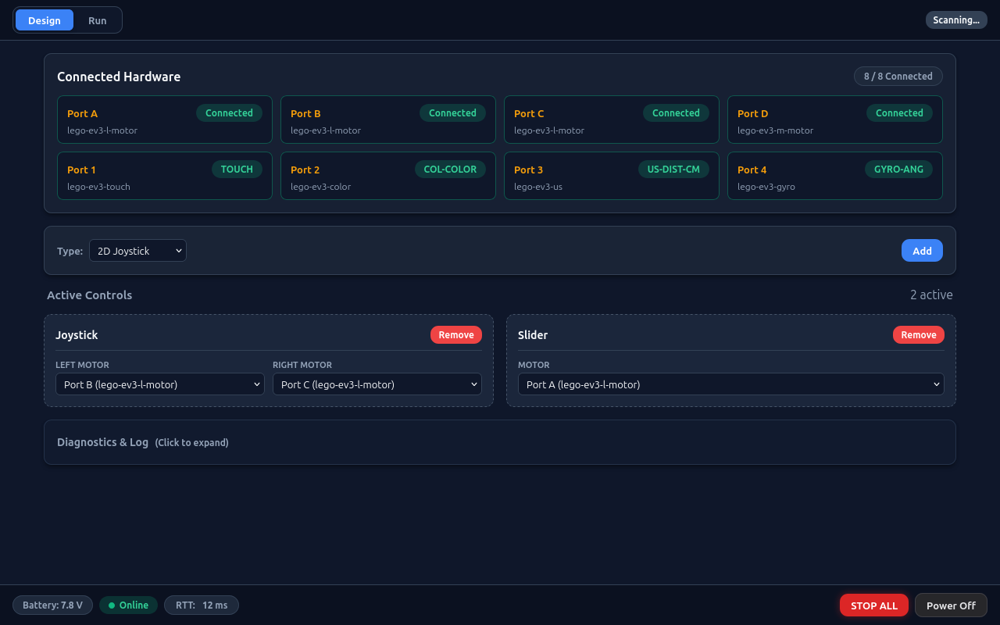
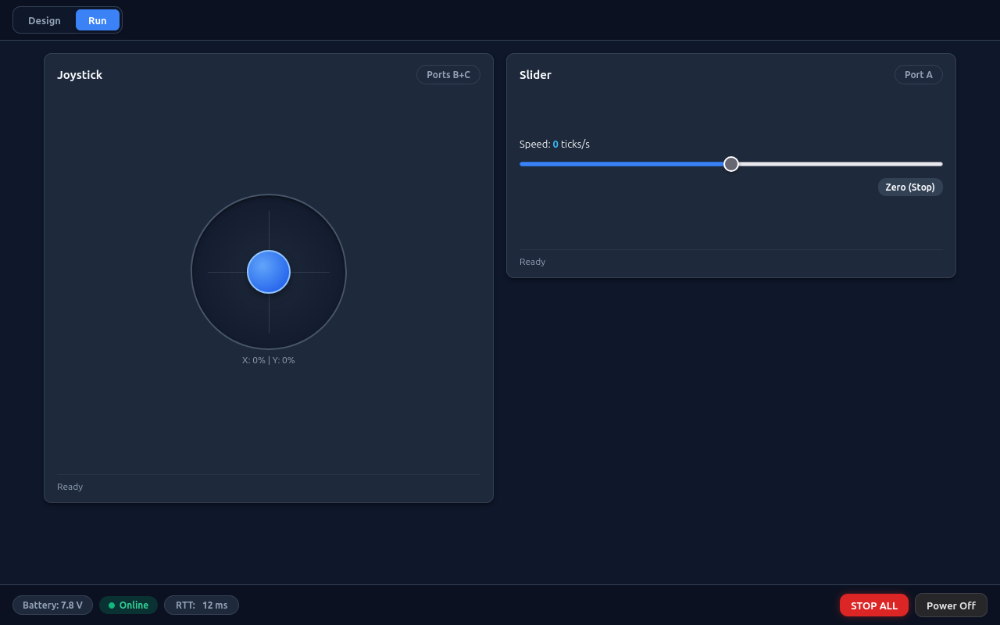
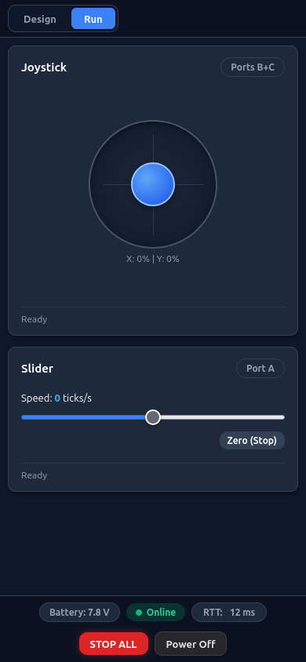

# LEGO Mindstorms EV3 Web Motor Control

A fast, lightweight web server in Rust for the LEGO Mindstorms EV3 hardware (Texas Instruments Sitara AM1808, ARMv5te @ 300MHz, 64MB DRAM).

| Design View (`/design`) | Run View Desktop (`/run`) | Run View Mobile (390×844) |
| :---: | :---: | :---: |
|  |  |  |

---

## Quickstart

### 1. Standalone Appliance Setup (1-Click Flashing)
Bake a pre-configured image with your Wi-Fi credentials and flash your MicroSD card:
```bash
sudo ./tools/bake-image.sh --ssid "<SSID>" --password "<PASSWORD>" && sudo ./tools/flash-image.sh /dev/sdX
```
Insert the card and a compatible USB Wi-Fi dongle into the EV3 brick. The brick connects to Wi-Fi automatically and displays its web address (`http://<ip>/`) on the LCD screen.

### 2. Host Simulation Testing
Test the complete web interface, 2D joystick, and simulated motors on your PC without EV3 hardware:
```bash
cargo run -- --mock --port 8080
# Open http://localhost:8080/ in your browser
```

---

## Documentation Guides

Detailed guides are modularized in the [`docs/`](docs/) directory:

- **[Appliance Setup Guide](docs/setup.md):** Detailed image baking (`tools/bake-image.sh`), drive verification, command-line flashing (`tools/flash-image.sh`), and first boot.
- **[Development & Deployment Guide](docs/development.md):** Cross-compilation toolchain, host simulation, USB networking (Windows RNDIS / macOS CDC), and deployment scripts.
- **[System Architecture Guide](docs/architecture.md):** Runtime memory model, non-blocking sysfs polling, two-tier safety watchdogs, web asset pipeline, and code organization rules.
- **[REST API Reference](docs/api.md):** Complete JSON REST API reference table, unified `/api/port` controller, payload schemas, and examples.

---

## Key Features

- **Low Latency & High Efficiency:** Background polling thread caches kernel sysfs telemetry every 50 ms. HTTP requests read from memory in < 0.05 ms.
- **Low Memory Footprint:** Statically linked native Rust executable consuming < 3 MB RAM RSS, preventing Out-Of-Memory termination on 64 MB hardware.
- **Self-Updating Web Assets:** Web dashboard assets download and compress (`gzip -9`) at boot from GitHub, loading into RAM (~12 KB) with zero SD card wear.
- **Compile-Time Fallback:** Baseline gzip assets are embedded directly into the binary (`include_bytes!`), restoring damaged or offline files automatically.
- **Two-Tier Safety Watchdogs:** 400 ms differential drive heartbeat timeout with brake action, plus a 1,000 ms browser disconnect watchdog.
- **On-Brick LCD Status Display:** Native 7-row console status renderer on `/dev/tty1` displaying live IP, battery voltage, and motor telemetry.

---

## Project Structure

```
ev3_next/
├── Cargo.toml               # Cargo package configuration
├── ev3-web.service          # Systemd unit file for auto-start on boot
├── docs/*                   # Documentation guides and screenshots
├── tools/                   # Appliance automation scripts (bake, flash, update)
├── src/                     # Rust application source (sysfs, controller, router)
├── web_assets/              # Web dashboard source (HTML, CSS, JavaScript)
└── archive/                 # Historical documents and legacy USB deploy scripts
```

---

## License
MIT / Apache 2.0
